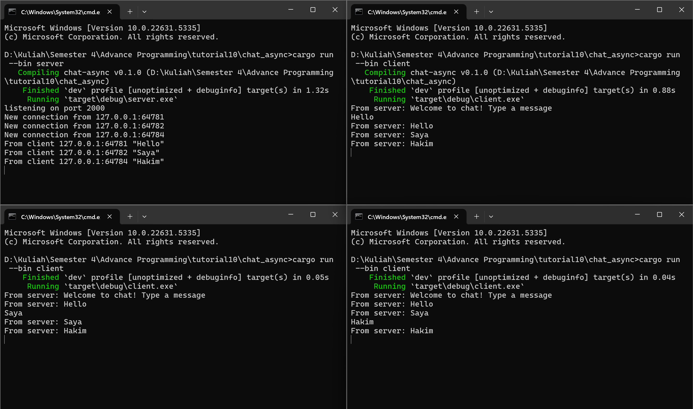
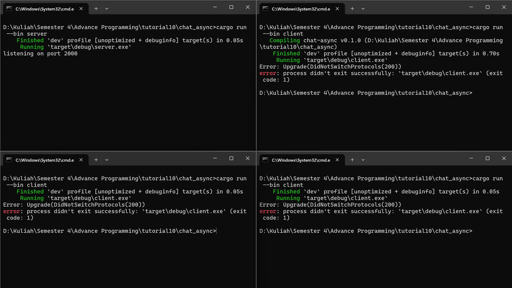

# adpro-module10-broadcast-chat

### 2.1: Original code, and how it run

Ketika melakukan run satu server `cargo run --bin server` dan tiga client `cargo run --bin client` secara bersamaan server mendengarkan port 2000. Ketika pengiriman pesan oleh client, server akan menerima pensan tersebut dan baru kemudian pesan tersebut akan didistribusikan kepada seluruh client yang terhubung. Hal ini menunjukkan mekanisme broadcast, di mana satu pesan dikirim ke banyak penerima.

### 2.2: Modifying port

Jika web socket client diubah dari port 2000 ke 8080, client tidak akan lagi terhubung dengan server karena server masih menggunakan port 2000. Ketika server dijalankan ia akan mendengarkan port 2000 dan ketika client dijalankan ia akan memunculkan error karena server tidak terdapat port 8080 yang sedang berjalan. Jika ingin menggunakan port 8080, maka server juga harus diubah agar mendengarkan di port yang sama, yaitu 8080. Dengan begitu, client dan server bisa saling terhubung dengan benar.